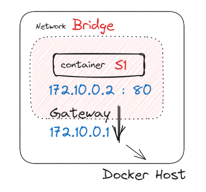

# Container Networking

container 具有隔離的性質，但是有時候又會需要與本機的其他 container 進行溝通，甚至外部的服務。

## Port forwarding

```shell
docker run -dp 80:80 --name s1 httpd

curl http://localhost:80
curl http://${hostname}:80

## all success connect to container
```

在跑一些服務時，通常會使用 port forwarding 讓 container 內的 port 對應到本機的 port，
代表說，這個 container 必然是放在某個網路裡。

> How? 用 `docker inspect` 指令來試試看

```shell
docker inspect s1
```

```json
{
  ...,
  "Networks": {
    "bridge": {
      "IPAMConfig": null,
      "Links": null,
      "Aliases": null,
      "NetworkID": "e31267bef3138aa22d755da24047a03e98584ac44b2715dd723cc8e4b58e95ff",
      "EndpointID": "53dccc85e760460a46af186090ed262d46eb2e349a8e2002874146bc3688083f",
      "Gateway": "172.17.0.1",
      "IPAddress": "172.17.0.2",
      "IPPrefixLen": 16,
      "IPv6Gateway": "",
      "GlobalIPv6Address": "",
      "GlobalIPv6PrefixLen": 0,
      "MacAddress": "02:42:ac:11:00:02",
      "DriverOpts": null
    }
  }
}
```

看起來這個 container 被放在 docker host 內，如下圖，但是直接去打是沒有辦法連上的，Why?



```shell
# no response
curl http://172.17.0.2
```
